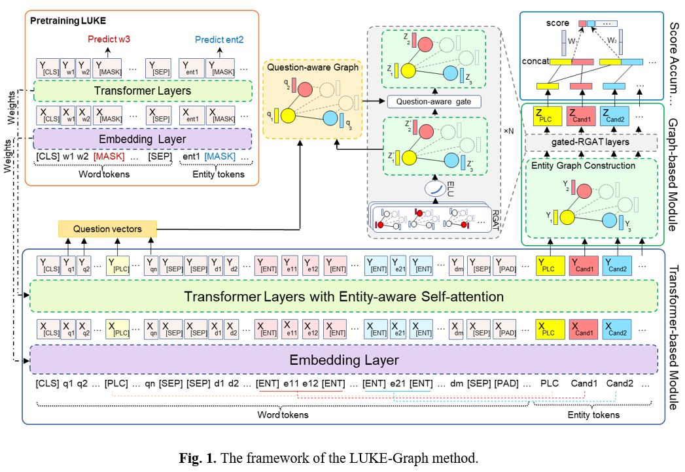

# LUKE-Graph: A Transformer-based Approach with Gated Relational Graph Attention for Cloze-style Reading Comprehension

[](https://www.sciencedirect.com/science/article/abs/pii/S0925231223009098)
[](https://github.com/studio-ousia/luke)

> **LUKE-Graph: A Transformer-based Approach with Gated Relational Graph Attention for Cloze-style Reading Comprehension**  
> Shima Foolad, Kourosh Kiani  
> Department of Electrical & Computer Engineering, Semnan University, Semnan, Iran  
> *Published in Neurocomputing*

---

## Overview

LUKE-Graph is a hybrid reading comprehension model that combines the strengths of **transformer-based entity-aware representations** (via [LUKE](https://github.com/studio-ousia/luke)) and **graph-based relation-aware reasoning** (via Gated Relational Graph Attention Networks). It is designed for cloze-style machine reading comprehension tasks, particularly those requiring commonsense and multi-hop reasoning.

Incorporating prior knowledge into pre-training models has shown promise for cloze-style reading comprehension. However, existing approaches that rely on external knowledge graphs (KGs) struggle with identifying the most relevant ambiguous entities and extracting optimal subgraphs. LUKE-Graph addresses these challenges by **constructing a heterogeneous graph directly from entity relationships within the document**, without relying on any external KG.

---

## Framework



---

### Architecture

```
Input passage + query
        │
        ▼
┌───────────────────────┐
│  LUKE Transformer      │   (entity-aware self-attention)
│  Encoder               │
└──────────┬────────────┘
           │  word states       entity states
           │      │                  │
           │      └──────┐     ┌─────┘
           │             ▼     ▼
           │      ┌──────────────────┐
           │      │  Gated RGCN      │   3 relation types:
           │      │  (2 layers)      │   • placeholder ↔ entity
           │      │                  │   • co-sentence
           └─────►│  Question-aware  │   • co-reference
                  │  Gate            │
                  └────────┬─────────┘
                           │ updated entity states
                           ▼
                  ┌─────────────────┐
                  │  Linear Scorer  │   concat([PLACEHOLDER], entity_i)
                  └────────┬────────┘
                           │
                           ▼
                    Predicted answer entity
```

### Edge Relation Types

| Type | Label | Description |
|------|-------|-------------|
| 0 | Placeholder | Bidirectional edges between every entity node and the `[PLACEHOLDER]` node |
| 1 | Co-sentence | Edges between distinct entity occurrences in the **same sentence** |
| 2 | Co-reference | Edges between entity occurrences sharing the **same surface text** across different sentences |

---

## Repository Structure

```
luke_graph/
├── __init__.py
├── main.py                  # Training & evaluation CLI entrypoint
├── model.py                 # LukeGraphForEntitySpanQA + GatedRGCN
├── requirements.txt
├── setup.py
│
├── data/                    # Data loading and feature extraction
│   ├── __init__.py
│   ├── constants.py         # Special token strings
│   ├── processor.py         # InputExample, RecordProcessor
│   └── features.py          # InputFeatures, convert_examples_to_features
│
├── graph/                   # Graph construction
│   └── __init__.py          # build_entity_graph, relation type constants
│
└── evaluation/              # Metrics
    ├── __init__.py
    └── record_eval.py       # EM / F1 evaluation (ReCoRD official script)
```

---

## Installation

### 1. Clone and install LUKE

```bash
git clone https://github.com/studio-ousia/luke.git
cd luke
pip install -e .
cd ..
```

### 2. Install LUKE-Graph

```bash
git clone https://github.com/<your-username>/luke-graph.git
cd luke-graph
pip install -e .
```

### 3. Install PyTorch Geometric

Follow the [official installation guide](https://pytorch-geometric.readthedocs.io/en/latest/notes/installation.html) for your CUDA version.  For example:

```bash
pip install torch-scatter torch-sparse torch-geometric \
    -f https://data.pyg.org/whl/torch-2.0.0+cu118.html
```

---

## Data

Download the [ReCoRD dataset](https://sheng-z.github.io/ReCoRD-explorer/) and place the files as:

```
data/
└── record/
    ├── train.json
    └── dev.json
```

Download the LUKE pre-trained model weights from the [LUKE releases page](https://github.com/studio-ousia/luke/releases).

---

## Usage

### Training

```bash
python -m luke_graph.main entity-span-qa run \
    --data-dir data/record \
    --num-train-epochs 2 \
    --train-batch-size 1 \
    --seed 4
```

### Evaluation only (with a saved checkpoint)

```bash
python -m luke_graph.main entity-span-qa run \
    --data-dir data/record \
    --no-train \
    --checkpoint-file outputs/record/pytorch_model.bin
```

### Standalone evaluation script

```bash
python -m luke_graph.evaluation.record_eval \
    data/record/dev.json \
    outputs/record/predictions.json \
    --output-correct-ids
```

---

## Key Hyperparameters

| Argument | Default | Description |
|----------|---------|-------------|
| `--max-seq-length` | 512 | Maximum total token sequence length |
| `--max-query-length` | 90 | Maximum query tokens |
| `--doc-stride` | 128 | Sliding window stride for long documents |
| `--num-train-epochs` | 2.0 | Number of training epochs |
| `--train-batch-size` | 1 | Training batch size per GPU |
| `--eval-batch-size` | 32 | Evaluation batch size |
| `--seed` | 4 | Random seed |

---

## Results

### ReCoRD Dataset (Commonsense Reasoning)

| Model | Dev F1 | Dev EM | Test F1 | Test EM |
|---|---|---|---|---|
| Human | 91.64 | 91.28 | 91.69 | 91.31 |
| BERT-Base | - | - | 56.1 | 54.0 |
| BERT-Large | 72.2 | 70.2 | 72.0 | 71.3 |
| Graph-BERT | - | - | 63.0 | 60.8 |
| SKG-BERT | 71.6 | 70.9 | 72.8 | 72.2 |
| KT-NET | 73.6 | 71.6 | 74.8 | 73.0 |
| XLNet-Verifier | 82.1 | 80.6 | 82.7 | 81.5 |
| KELM | 75.6 | 75.1 | 76.7 | 76.2 |
| RoBERTa | 89.5 | 89.0 | 90.6 | 90.0 |
| T5-Large | - | - | 86.8 | 85.9 |
| T5-11B | 93.8 | 93.2 | 94.1 | 93.4 |
| PaLM 540B | **94.0** | **94.6** | 94.2 | 93.3 |
| DeBERTa-1.5B (Ensemble) | 91.4 | 91.0 | **94.5** | **94.1** |
| LUKE | 90.96 | 90.4 | 91.2 | 90.6 |
| **LUKE-Graph (ours)** | **91.36** | **90.95** | **91.5** | **91.2** |

> All models are based on a single model except for DeBERTa.

### WikiHop Dataset (Multi-hop Reasoning)

| Model | Dev Acc | Test Acc |
|---|---|---|
| Human | - | 74.1 |
| Entity-GCN | 64.8 | 67.6 |
| BAG | 66.5 | 69.0 |
| CFC | 66.4 | 70.6 |
| HDEGraph | 68.1 | 70.9 |
| Path-GCN | 70.8 | 72.5 |
| Longformer-base | 75.0 | - |
| Longformer-large | 77.6 | 81.9 |
| ETC-large | **79.8** | 82.3 |
| RealFormer-large | 79.21 | **84.4** |
| LUKE | 73.2 | 77.1 |
| **LUKE-Graph (ours)** | **77.8** | **81.0** |

> All models are based on a single model for fair comparison.

LUKE-Graph **surpasses the LUKE state-of-the-art baseline** on both the ReCoRD and WikiHop datasets.

---

## Based On

This repository builds upon the official LUKE implementation:

> **[studio-ousia/luke](https://github.com/studio-ousia/luke)**  
> Specifically, changes were applied based on the [`examples/legacy/entity_span_qa`](https://github.com/studio-ousia/luke/blob/master/examples/legacy/entity_span_qa) component.

---

## Citation

If you use this work, please cite:

```bibtex
@article{foolad2024lukegraph,
  title     = {LUKE-Graph: A Transformer-based Approach with Gated Relational Graph Attention for Cloze-style Reading Comprehension},
  author    = {Foolad, Shima and Kiani, Kourosh},
  journal   = {Neurocomputing},
  year      = {2023},
  publisher = {Elsevier}
}
```

